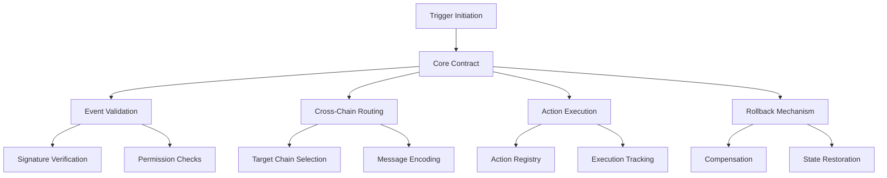

# RFC Trigger Protocol

A decentralized cross-chain trigger protocol enabling automated and secure action initiation across blockchain networks. RFC Trigger provides a robust mechanism for executing cross-chain events and synchronizing actions between different blockchain environments.

## Overview

RFC Trigger is a groundbreaking cross-chain coordination protocol that enables:

- Decentralized cross-chain event triggering
- Secure and verifiable action synchronization
- Protocol-agnostic trigger mechanisms
- Flexible action routing and execution
- Trustless inter-blockchain communication
- Minimal latency cross-chain operations
- Robust error handling and rollback support

## Architecture

The protocol leverages a core smart contract that manages cross-chain trigger mechanisms:



### Core Components:

1. **Trigger Management**
   - Cross-chain event definition
   - Secure trigger initiation
   - Multi-signature validation

2. **Routing System**
   - Dynamic blockchain targeting
   - Encrypted message transmission
   - Configurable routing parameters

3. **Execution Framework**
   - Action registry and validation
   - Atomicity guarantees
   - Compensation mechanisms

## Getting Started

### Prerequisites

- Clarity CLI
- Cross-chain compatible wallet
- Supported blockchain network access

### Basic Usage

1. **Initiate Cross-Chain Trigger**
```clarity
(contract-call? .rfc-trigger-core create-trigger 
    "target-chain" 
    "action-type" 
    { payload: some-data })
```

2. **Verify Trigger**
```clarity
(contract-call? .rfc-trigger-core verify-trigger 
    trigger-id)
```

3. **Execute Trigger**
```clarity
(contract-call? .rfc-trigger-core execute-trigger
    trigger-id
    { execution-params })
```

## Function Reference

### Trigger Management

- `create-trigger`: Define a new cross-chain trigger
- `verify-trigger`: Validate trigger prerequisites
- `cancel-trigger`: Abort pending trigger
- `update-trigger`: Modify trigger parameters

### Routing System

- `set-route`: Configure cross-chain routing
- `get-route`: Retrieve routing information
- `validate-route`: Check route eligibility

### Execution Framework

- `register-action`: Define executable actions
- `execute-trigger`: Perform cross-chain action
- `rollback-trigger`: Compensate failed operations

## Security Considerations

### Cross-Chain Validation
- Multi-signature trigger authentication
- Cryptographic payload verification
- Replay attack prevention
- Nonce-based transaction uniqueness

### Execution Safety
- Atomic transaction guarantees
- Comprehensive error handling
- Partial execution compensation
- Transparent rollback mechanisms

## Development

### Local Testing

1. Deploy contract:
```bash
clarinet deploy
```

2. Run test suite:
```bash
clarinet test
```

### Key Constants

```clarity
MAX-TRIGGER-LIFETIME: u1000 (blocks)
MIN-SIGNATURES-REQUIRED: u2
DEFAULT-TIMEOUT: u144 (approx. 24 hours)
```

### Trigger States

```clarity
TRIGGER-PENDING: u1
TRIGGER-VERIFIED: u2
TRIGGER-EXECUTED: u3
TRIGGER-FAILED: u4
```